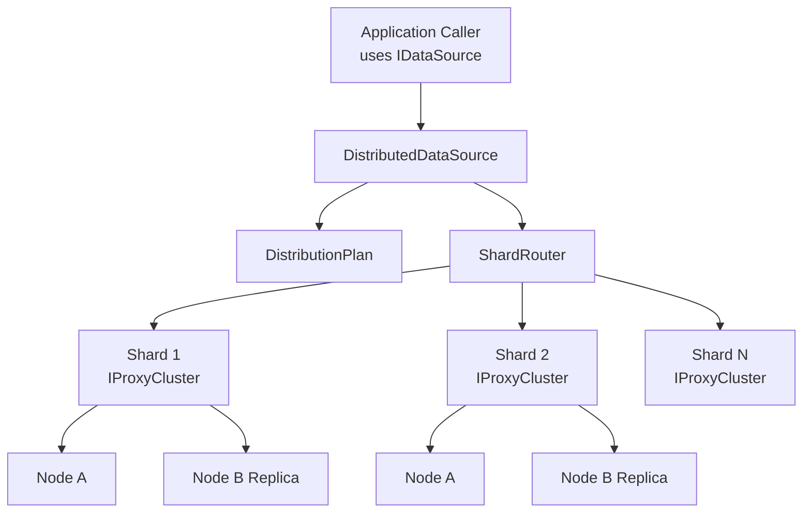

# DistributedDataSource Enhancement Plans

Phased, execution-ready roadmap for implementing a new `DistributedDataSource` in
`DataManagementEngineStandard/DistributedDatasource/Distributed/`.

`DistributedDataSource` is a first-class `IDataSource` that distributes entities
(tables) and rows across multiple physical datasources. Each shard is itself an
HA pool implemented by an existing `IProxyCluster` (see `Proxy/ProxyCluster.cs`),
so per-shard failover, circuit breaking, and load-balancing are reused from
`Proxy/` rather than reinvented.

## Design Decisions (locked at planning time)

- v1 supports BOTH entity-level distribution (split tables across shards or
  duplicate them for replication) AND row-level (intra-entity) sharding by
  partition key.
- `DistributedDataSource` COMPOSES `ProxyCluster` (one cluster per shard).
  It does NOT extend `ProxyDataSource`, and it does NOT replace `ProxyCluster`.
- Routing is policy-driven via a `DistributionPlan` persisted through
  `ConfigEditor` (same pattern as `ProxyCluster.SaveNodesToConfig`).
- One class per file. Partial classes for orchestrators that grow large
  (`DistributedDataSource.*.cs`).

## Per-Entity Distribution Modes

| Mode        | Meaning                                                                 |
|-------------|-------------------------------------------------------------------------|
| Sharded     | Rows of the entity are split across N shards via a partition function   |
| Replicated  | Entity exists on every shard; writes fan-out, reads from any            |
| Routed      | Entity lives on exactly one shard (entity-level placement, no row split)|
| Broadcast   | Reference table; reads any shard, writes go everywhere                  |

## Architecture Snapshot

## Execution Order

1. [00-overview-distributeddatasource-gap-matrix.md](./00-overview-distributeddatasource-gap-matrix.md)
2. [01-phase1-core-contracts-and-skeleton.md](./01-phase1-core-contracts-and-skeleton.md)
3. [02-phase2-distribution-plan-and-shard-catalog.md](./02-phase2-distribution-plan-and-shard-catalog.md)
4. [03-phase3-entity-placement-and-replication-modes.md](./03-phase3-entity-placement-and-replication-modes.md)
5. [04-phase4-partition-functions-row-level.md](./04-phase4-partition-functions-row-level.md)
6. [05-phase5-shard-router-and-key-extraction.md](./05-phase5-shard-router-and-key-extraction.md)
7. [06-phase6-read-execution-single-and-scatter.md](./06-phase6-read-execution-single-and-scatter.md)
8. [07-phase7-write-execution-sharded-replicated-broadcast.md](./07-phase7-write-execution-sharded-replicated-broadcast.md)
9. [08-phase8-cross-shard-query-planner-and-merger.md](./08-phase8-cross-shard-query-planner-and-merger.md)
10. [09-phase9-distributed-transactions.md](./09-phase9-distributed-transactions.md)
11. [10-phase10-resilience-and-shard-down-policy.md](./10-phase10-resilience-and-shard-down-policy.md)
12. [11-phase11-resharding-and-rebalancing.md](./11-phase11-resharding-and-rebalancing.md)
13. [12-phase12-schema-management-and-ddl-broadcast.md](./12-phase12-schema-management-and-ddl-broadcast.md)
14. [13-phase13-observability-security-audit.md](./13-phase13-observability-security-audit.md)
15. [14-phase14-performance-and-capacity-engineering.md](./14-phase14-performance-and-capacity-engineering.md)
16. [15-phase15-devex-testing-and-rollout-governance.md](./15-phase15-devex-testing-and-rollout-governance.md)
17. [MASTER-TODO-TRACKER.md](./MASTER-TODO-TRACKER.md)

## Primary Outcomes

- A production-ready `DistributedDataSource : IDataSource` that splits or
  replicates entities across many backends transparently.
- Pluggable partition functions for row-level sharding inside a single entity.
- Per-shard HA delegated to existing `IProxyCluster`.
- Persistent distribution plan via `ConfigEditor`, with safe resharding tooling.

## Out of Scope (v1)

- Cross-shard joins beyond the basic merger (Phase 8). Complex SQL planner is a
  future enhancement.
- Global secondary indexes (eventual consistency only via per-shard scatter).
- Strict serializable distributed transactions on backends without 2PC support.
