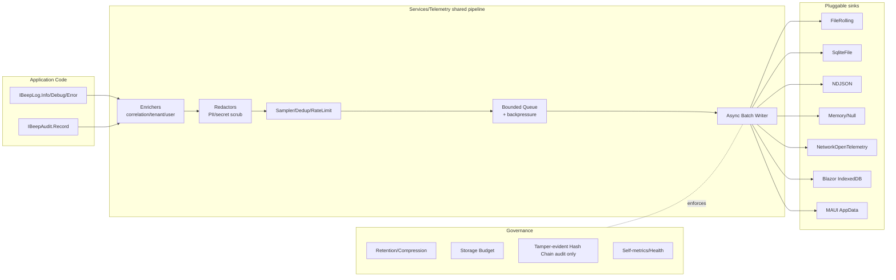

# Beep Logging & Audit-Trail Services — Phased Implementation Plan

> Location: `BeepDM/DataManagementEngineStandard/Services/Plans/`
> Future code roots: `Services/Telemetry/` (shared pipeline), `Services/Logging/`, `Services/Audit/`
> Companion plans: `DistributedDatasource/DistributedPlans/13-phase13-observability-security-audit.md`, `Editor/Forms/Helpers/AuditManager.cs`, `Proxy/IProxyAuditSink.cs`

## 1. Goal

Add **two opt-in, cross-platform features** to `BeepService`:

1. **`IBeepLog`** — a unified, structured, sink-pluggable, redaction/sampling-aware logger that supersedes the ad-hoc `IDMLogger` console pipeline without breaking it.
2. **`IBeepAudit`** — a system-wide audit-trail service that unifies the scattered audit sinks (`AuditManager`, `IProxyAuditSink`, distributed `IDistributedAuditSink`) under one canonical `AuditEvent` schema, with tamper-evident hash chain, retention/budget controls, and GDPR-style purge.

Both features must be **registered explicitly** through `BeepServiceExtensions.{Desktop,Web,Blazor}` (off by default) and must respect tight **storage budgets** so they're safe to ship in low-storage environments (mobile, edge, embedded, browser).

## 2. Why a single program (Log + Audit together)

Logging and audit share **the same infrastructure**:

- async batched writer with bounded queue + backpressure,
- pluggable sinks (file, SQLite, NDJSON, network, memory, null),
- rolling/compression/retention,
- redaction & PII scrubbing,
- enrichment (correlation/trace/tenant/user),
- self-metrics & health.

They differ only in **schema** and **semantics** (audit needs canonical event types, immutability, tamper evidence; logs are free-form and lossy under pressure). Building them as one program lets us share the pipeline and ship both with one rollout.

## 3. Design pillars

| Pillar | Decision |
|---|---|
| **Opt-in** | Both features are **off by default**; enabled via `services.AddBeepLogging(...)` / `services.AddBeepAudit(...)` extensions. |
| **Cross-platform** | No `Win32`/`EventLog`/`PerformanceCounter`/Windows-only paths. Use `System.IO`, `Path.Combine`, `Environment.SpecialFolder`/`AppContext.BaseDirectory`, `MAUI FileSystem.AppDataDirectory`, Blazor IndexedDB bridge. |
| **Storage-conscious** | Hard caps on (a) queue depth, (b) per-file size, (c) total directory size, (d) retention days. Compression on rotate. Sampling + dedup at the source. Ring-buffer mode that drops oldest when over budget. |
| **Lossy logs, lossless audit** | Logs may be sampled/dropped under backpressure. Audit events block-or-fail by policy and never silently disappear. |
| **Composition over inheritance** | Reuse `Microsoft.Extensions.Logging` as the substrate; bridge legacy `IDMLogger` and `IProxyAuditSink` rather than rewriting. |
| **Single MASTER tracker** | Per user rules: one `MASTER-TODO-TRACKER.md`; one phase-doc per phase; one class per file; partial classes for orchestrators. |

## 4. Per-feature activation surface

```csharp
services.AddBeepLogging(opt =>
{
    opt.Enabled         = true;
    opt.MinLevel        = LogLevel.Information;
    opt.AddFileSink("beep-logs", maxFileBytes: 5 * 1024 * 1024, maxFiles: 10);
    opt.AddSamplingPolicy(LogLevel.Debug, sampleRate: 0.1);
    opt.AddRedactor(new RegexRedactor(@"(?i)password\s*=\s*[^;]+"));
    opt.StorageBudgetBytes = 50 * 1024 * 1024;
});

services.AddBeepAudit(opt =>
{
    opt.Enabled        = true;
    opt.Sink           = AuditSink.SqliteFile("beep-audit.db");
    opt.HashChain      = true;        // tamper evidence
    opt.RetentionDays  = 365;
    opt.StorageBudgetBytes = 200 * 1024 * 1024;
    opt.RedactPiiFields(new[] { "Email", "Ssn", "Phone" });
});
```

## 5. Architecture (high level)



## 6. Phase order

| # | Phase | Output |
|---|---|---|
| 00 | Overview & gap matrix | Component inventory + go/no-go for v1 |
| 01 | Core contracts & feature toggles | `IBeepLog`, `IBeepAudit`, options, registration extensions |
| 02 | Shared pipeline, sinks, async batching | `TelemetryPipeline`, `BoundedChannelQueue`, `BatchWriter` |
| 03 | Storage providers (cross-platform) | File, SQLite, NDJSON, Memory, Null sinks |
| 04 | Retention, rotation, compression, storage budget | `RotationPolicy`, `RetentionPolicy`, `StorageBudget` |
| 05 | Redaction, PII & secret scrubbing | `IRedactor`, regex/keyword/structured redactors |
| 06 | Enrichment, correlation, ambient context | `BeepActivityScope` (AsyncLocal), enrichers |
| 07 | Sampling, dedup & rate limiting | `ISampler`, `MessageDeduper`, `TokenBucketRateLimiter` |
| 08 | Audit event schema & tamper evidence | `AuditEvent` v1, `HashChainSigner`, integrity verifier |
| 09 | Integration with existing subsystems | Bridges for `IDMLogger`, `AuditManager`, `IProxyAuditSink`, distributed sinks |
| 10 | Query, export, purge, compliance | Query API, CSV/JSON/NDJSON export, GDPR purge by user/entity |
| 11 | Self-observability & health | Drop counters, queue depth, sink health, fail-open/fail-closed metrics |
| 12 | Platform targets (Blazor/MAUI/Server) | IndexedDB bridge, MAUI AppData store, web server roots |
| 13 | DevEx, testing, rollout, docs | Test sinks, fault injection, perf harness, runbook |

## 7. Out of scope (v1)

- Building a full SIEM / log analytics UI.
- Replacing `Microsoft.Extensions.Logging` — we plug into it.
- Multi-tenant log routing fabric (tenant tag is supported, but routing is single-process).
- Encrypting log payloads at rest (only **redaction** + tamper evidence; full at-rest encryption is a v2 add-on).

## 8. References

- `DataManagementModelsStandard/Logger/IDMLogger.cs`
- `DataManagementEngineStandard/Logger/DMLogger.cs`
- `DataManagementEngineStandard/Editor/Forms/Helpers/AuditManager.cs`, `FileAuditStore.cs`, `InMemoryAuditStore.cs`
- `DataManagementEngineStandard/Proxy/IProxyAuditSink.cs`, `FileProxyAuditSink.cs`, `ProxyLogRedactor.cs`
- `DataManagementEngineStandard/DistributedDatasource/DistributedPlans/13-phase13-observability-security-audit.md`
- `DataManagementEngineStandard/Services/BeepService.cs`, `BeepServiceExtensions.{Desktop,Web,Blazor}.cs`
